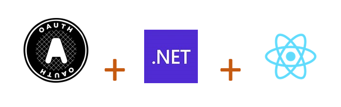

# oauth2-dotnet-react
A complete OpenAuth2 functional example based on Official documents, course and specifications for .NET C# + ReactJS developers.

Dive deeper with this Udemy course, which is also official: [The Nuts and Bolts of OAuth 2.0
](https://www.udemy.com/share/103UzM3@EfMYWG4sWtdnuwJjIYmYtSaCf2Nc2A-D5wY7ZT1rKGORyqQAwfOBcMtAuHaVSPLD/)

## .NET
Two .NET6 WebAPI projects implmenting OpenAuth2: (i) one project as OpenAuth2 authorization server and (ii) one project as resources server; Respectvely:

    📁 dotnet-servers
     | ->   📁 api
     | ->   📁 auth

## ReactJS
A ReactJS *18* project implement the complete SPA OpenAuth2 flow to login, logout and refresh token processes.

    📁 react-client

### Getting Started

For .NET projects execute `dotnet run` on the root folder of the projects. That will setup and start the APIs.

For the ReactJS project execute `yarn` and `yarn start` or `npm install` and `npm start`..

After setup access `http:\\localhost:3000` and login to start having fun right away use one of the credentials below:

    - ben@gmail.com | 123456 
    - bob@gmail.com | 123456
    - doe@gmail.com | 123456

You are good to go!
